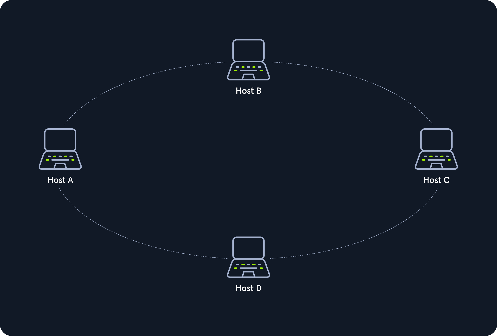
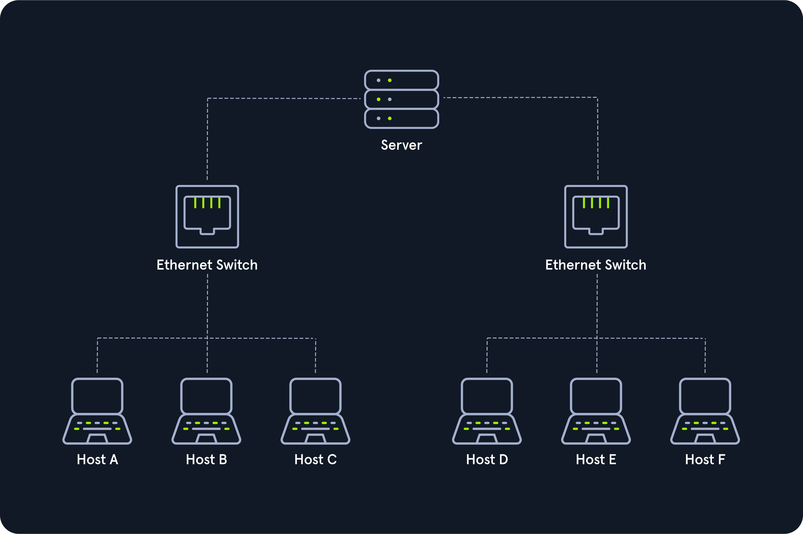
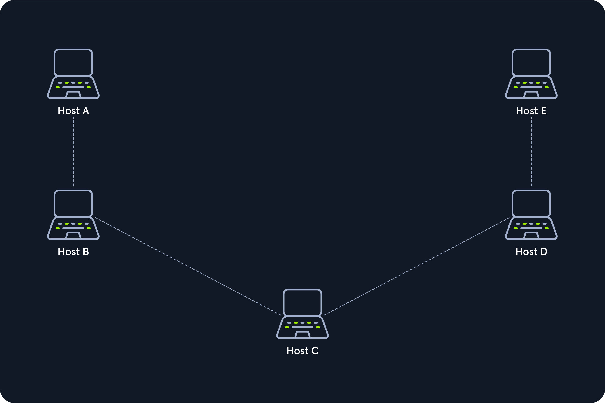

# Topologias de Rede

Uma topologia de rede é o arranjo físico e/ou lógico das conexões de dispositivos em uma rede. Envolve hosts como clientes e servidores, além de componentes de rede como switches, bridges e routers, que facilitam a conexão entre os hosts.

## Tipos de Conexões

### Conexões com Fio
- Cabeamento coaxial
- Cabeamento de fibra de vidro
- Cabeamento de par trançado
- Outros

### Conexões sem Fio
- Wi-Fi
- Celular
- Satélite
- Outros

## Nós - Controladores de Interface de Rede (NICs)

Incluem repetidores, hubs, pontes, switches, roteadores/modems, firewalls, entre outros. Esses nós são pontos de conexão para transmissão e recepção de sinais na mídia de transmissão.

## Classificações

As topologias de rede podem ser físicas ou lógicas, não necessariamente correspondendo ao arranjo físico real dos dispositivos:

- **Topologias Físicas:** Refletem o layout físico dos dispositivos e do cabeamento.
- **Topologias Lógicas:** Como os dados são transmitidos na rede entre os dispositivos.

## Principais Tipos de Topologia

1. **Ponto a Ponto**
   - A topologia ponto a ponto é caracterizada por uma conexão direta e dedicada entre dois hosts. Nesta configuração, apenas dois dispositivos estão conectados, o que permite uma comunicação direta e eficiente entre eles sem a necessidade de compartilhar recursos com outros hosts na rede.
   

2. **Barramento**
   - Na topologia de barramento, todos os hosts compartilham um único meio de transmissão, conhecido como barramento. Cada host tem acesso igual ao meio e pode enviar dados que são ouvidos por todos os outros hosts na rede. A comunicação é feita de forma sequencial, onde cada host aguarda sua vez para transmitir.
   

3. **Estrela**
   - A topologia em estrela conecta cada host a um componente central da rede, como um hub ou switch. Cada host tem seu próprio caminho dedicado para se comunicar com o componente central, que atua como um ponto de distribuição de dados. Se um host falhar, os outros não são afetados, tornando esta topologia robusta e fácil de gerenciar.
   

4. **Anel**
   - Na topologia em anel, cada host é conectado em série ao próximo e ao anterior, formando um circuito fechado. Os dados são transmitidos em uma única direção ao redor do anel. Cada host recebe os dados e os encaminha para o próximo host até que os dados cheguem ao destinatário final. Um falha na conexão pode interromper toda a rede.
   

5. **Malha**
   - A topologia em malha é altamente redundante, onde cada host está conectado diretamente a todos os outros hosts na rede. Isso garante múltiplos caminhos de comunicação e alta confiabilidade. Se um caminho falhar, os dados podem ser roteados por um caminho alternativo, mantendo a integridade da rede.
   

6. **Árvore**
   - A topologia em árvore combina características da topologia em estrela e da topologia em barramento. Várias redes em estrela são conectadas através de um backbone principal, criando uma hierarquia. Isso é comum em grandes redes corporativas onde diferentes departamentos ou prédios são interconectados.
   

7. **Híbrida**
   - Topologias híbridas combinam duas ou mais topologias básicas para formar uma rede mais complexa e adaptável às necessidades específicas da organização. Por exemplo, uma rede híbrida pode combinar elementos de uma topologia em estrela e uma topologia em malha para maximizar a eficiência e a confiabilidade.
   

8. **Guirlanda de Margaridas (Daisy Chain)**
   - A topologia daisy chain conecta vários dispositivos em série, onde o último dispositivo está conectado de volta ao primeiro, formando uma cadeia. Essa configuração é comum em ambientes onde a ordem de comunicação entre os dispositivos é crucial e os dados fluem em uma única direção.
   
