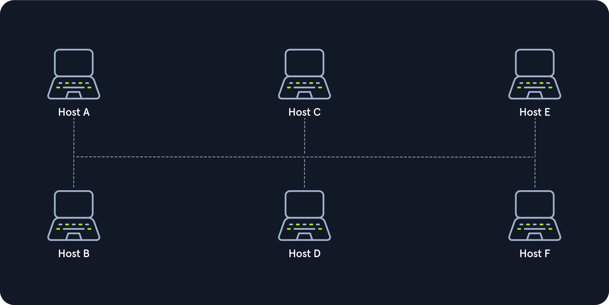
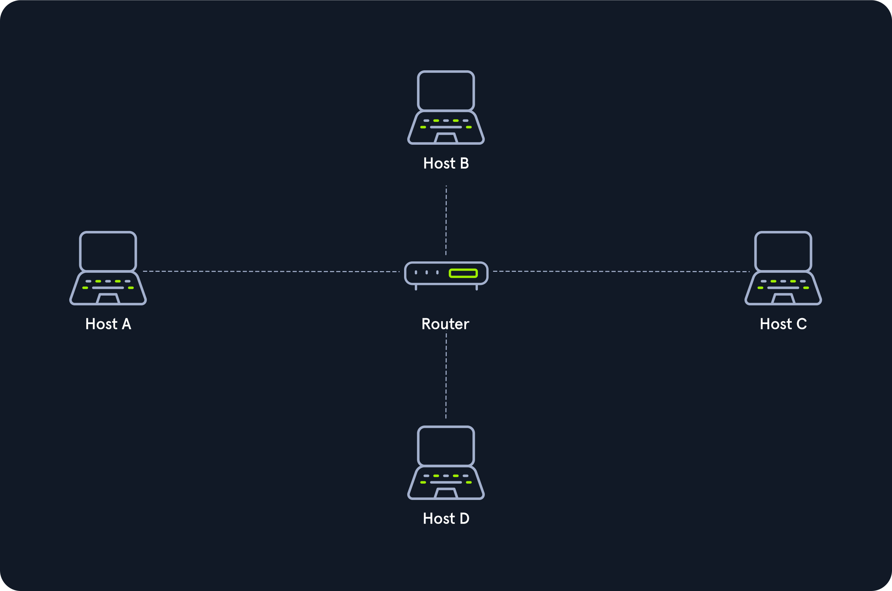
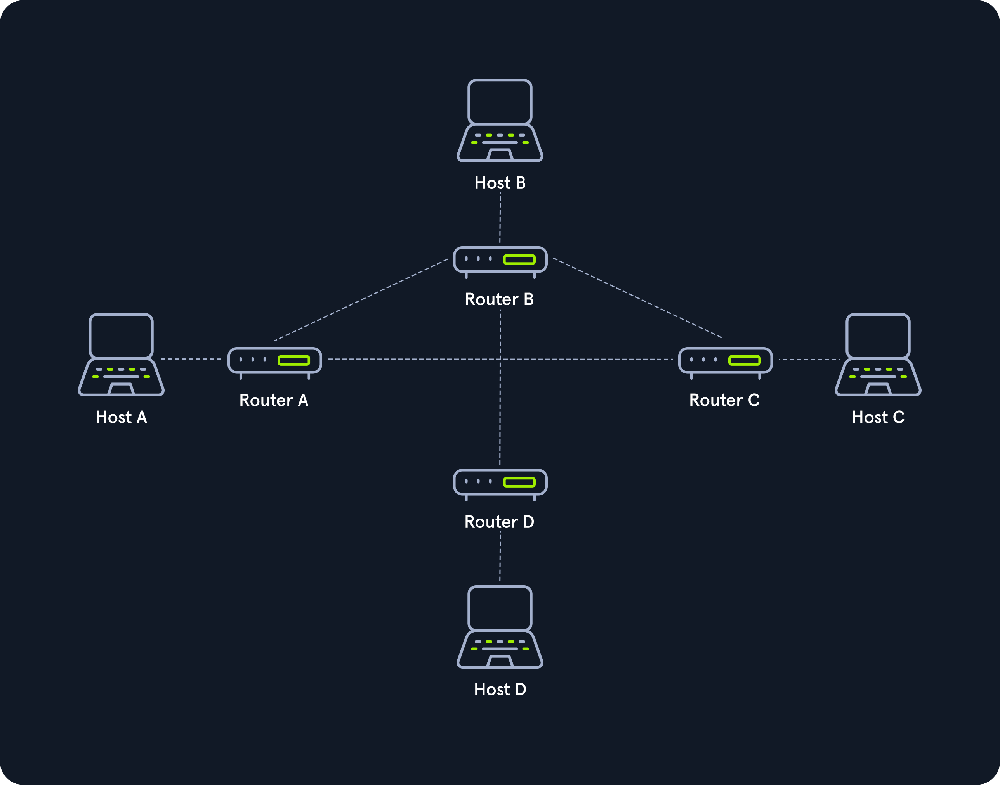

# Topologias de Rede

Uma topologia de rede é o arranjo físico e/ou lógico das conexões de dispositivos em uma rede. Envolve hosts como clientes e servidores, além de componentes de rede como switches, bridges e routers, que facilitam a conexão entre os hosts.

## Tipos de Conexões

### Conexões com Fio
- Cabeamento coaxial
- Cabeamento de fibra de vidro
- Cabeamento de par trançado
- Outros

### Conexões sem Fio
- Wi-Fi
- Celular
- Satélite
- Outros

## Nós - Controladores de Interface de Rede (NICs)

Incluem repetidores, hubs, pontes, switches, roteadores/modems, firewalls, entre outros. Esses nós são pontos de conexão para transmissão e recepção de sinais na mídia de transmissão.

## Classificações

As topologias de rede podem ser físicas ou lógicas, não necessariamente correspondendo ao arranjo físico real dos dispositivos:

- **Topologias Físicas:** Refletem o layout físico dos dispositivos e do cabeamento.
- **Topologias Lógicas:** Como os dados são transmitidos na rede entre os dispositivos.

## Principais Tipos de Topologia

1. **Ponto a Ponto**
   - Conexão direta e dedicada entre dois hosts. 
   

2. **Barramento**
   - Todos os hosts compartilham um meio de transmissão único.
   

3. **Estrela**
   - Cada host conectado a um componente central (hub, switch, ou roteador).
   

4. **Anel**
   - Cada host conectado a um anel com dois cabos para sinais de entrada e saída.
   

5. **Malha**
   - Todos os hosts estão conectados diretamente entre si para redundância e alta confiabilidade.
   

6. **Árvore**
   - Extensão da topologia de estrela para redes maiores, frequentemente hierárquica.
   

7. **Híbrida**
   - Combinação de duas ou mais topologias básicas.
   

8. **Guirlanda de Margaridas (Daisy Chain)**
   - Conexão em série de vários hosts, frequentemente usada em automação.
   
