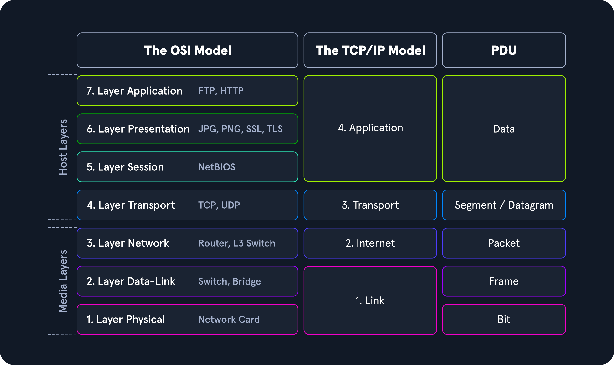

# Modelos de Rede

## Introdução

Dois modelos de rede descrevem a comunicação e a transferência de dados de um host para outro: o modelo ISO/OSI e o modelo TCP/IP. Estes modelos representam a transferência de bits em conteúdos legíveis para nós.

## O Modelo OSI

O modelo OSI, frequentemente chamado de modelo de camadas ISO/OSI, é um modelo de referência que descreve e define a comunicação entre sistemas. Este modelo tem sete camadas individuais, cada uma com tarefas claramente separadas.

- **Significado:** OSI significa "Open Systems Interconnection" (Interconexão de Sistemas Abertos).
- **Publicação:** Publicado pela International Telecommunication Union (ITU) e pela International Organization for Standardization (ISO).

## O Modelo TCP/IP

TCP/IP (Transmission Control Protocol/Internet Protocol) é um termo genérico para muitos protocolos de rede responsáveis pela comutação e transporte de pacotes de dados na Internet.

- **Componentes:** Inclui protocolos como ICMP (Internet Control Message Protocol) e UDP (User Datagram Protocol).
- **Função:** Fornece as funções necessárias para transportar e comutar pacotes de dados em redes privadas ou públicas.

## ISO/OSI vs. TCP/IP

- **TCP/IP:** Protocolo de comunicação que permite a conexão de hosts à Internet. Permite maior flexibilidade nas regras, desde que as diretrizes gerais sejam seguidas.
- **OSI:** Modelo de referência usado como gateway de comunicação entre a rede e os usuários finais. É conhecido por seu protocolo rígido e limitações.

## Transferências de Pacotes

Em um sistema em camadas, dispositivos em uma camada trocam dados em um formato chamado "Protocol Data Unit" (PDU). O processo de transmissão envolve várias etapas:

1. **Encapsulamento:** Cada camada adiciona um "header" ao PDU da camada superior para controlar e identificar o pacote.
2. **Transmissão:** Os dados são transferidos através da camada física da rede até o receptor.
3. **Desencapsulamento:** O receptor inverte o processo, descompactando os dados em cada camada usando as informações do cabeçalho.

## Importância para Testadores de Penetração

Para testadores de penetração, ambos os modelos de referência são úteis:

- **TCP/IP:** Ajuda a entender como toda a conexão é estabelecida.
- **OSI:** Permite desmontar a conexão peça por peça e analisá-la em detalhes.

Familiarizar-se com ambos os modelos é crucial para analisar tráfego de rede específico e interceptar dados de forma eficaz.

---

Este é um resumo simplificado para ajudar a entender os modelos de rede e suas funções. A seguir, veja as camadas do modelo OSI e suas respectivas funções:

### Camadas do Modelo OSI

1. **Camada Física (Physical Layer):** Transmissão de bits brutos pelo meio físico.
2. **Camada de Enlace de Dados (Data Link Layer):** Transferência de dados entre nós adjacentes.
3. **Camada de Rede (Network Layer):** Determinação do caminho e roteamento de pacotes.
4. **Camada de Transporte (Transport Layer):** Transferência confiável de dados entre pontos finais.
5. **Camada de Sessão (Session Layer):** Estabelecimento, gerenciamento e término de sessões.
6. **Camada de Apresentação (Presentation Layer):** Tradução, criptografia e compressão de dados.
7. **Camada de Aplicação (Application Layer):** Interação com o software de aplicação e usuários finais.

