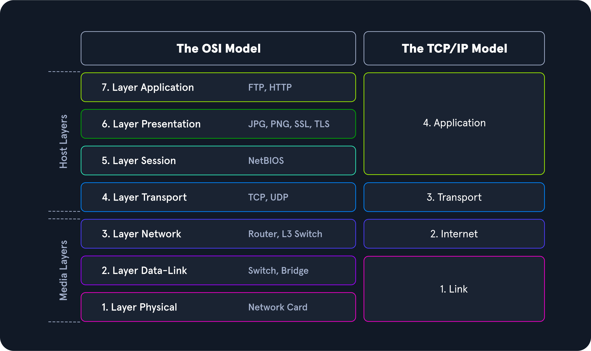

# Modelo TCP/IP

## Introdução

O modelo TCP/IP, frequentemente referido como Internet Protocol Suite, é um modelo de referência em camadas. TCP/IP significa Transmission Control Protocol (TCP) e Internet Protocol (IP). No modelo de camadas OSI, IP está localizado na camada de rede (Camada 3) e TCP na camada de transporte (Camada 4).

## Camadas do Modelo TCP/IP

### Camada 4: Aplicação (Application Layer)

- **Função:** Permite que aplicações acessem os serviços das outras camadas e define os protocolos usados pelas aplicações para troca de dados.
- **Exemplo:** HTTP, FTP, SMTP.

### Camada 3: Transporte (Transport Layer)

- **Função:** Responsável por fornecer serviços de sessão (TCP) e datagrama (UDP) para a camada de aplicação.
- **Exemplo:** TCP, UDP.

### Camada 2: Internet (Internet Layer)

- **Função:** Responsável pelo endereçamento de hosts, empacotamento e funções de roteamento.
- **Exemplo:** IP (IPv4, IPv6).

### Camada 1: Enlace (Link Layer)

- **Função:** Responsável por colocar os pacotes TCP/IP no meio de rede e receber os pacotes correspondentes do meio de rede. TCP/IP é projetado para funcionar independentemente do método de acesso à rede, formato de frame e meio.
- **Exemplo:** Ethernet, Wi-Fi.

## Funções Importantes do TCP/IP

### Endereçamento Lógico (Logical Addressing)

- **Protocolo:** IP
- **Descrição:** Devido ao grande número de hosts em diferentes redes, é necessário estruturar a topologia da rede e o endereçamento lógico. IP cuida do endereçamento lógico de redes e nós. Os pacotes de dados só alcançam a rede onde devem estar, utilizando classes de rede, subnetting e CIDR.

### Roteamento (Routing)

- **Protocolo:** IP
- **Descrição:** Para cada pacote de dados, o próximo nó é determinado em cada nó ao longo do caminho do remetente ao destinatário. Dessa forma, um pacote de dados é roteado para seu destinatário, mesmo que a localização seja desconhecida para o remetente.

### Controle de Erro e Fluxo (Error & Control Flow)

- **Protocolo:** TCP
- **Descrição:** O remetente e o destinatário estão frequentemente em contato através de uma conexão virtual. Mensagens de controle são enviadas continuamente para verificar se a conexão ainda está estabelecida.

### Suporte à Aplicação (Application Support)

- **Protocolo:** TCP
- **Descrição:** As portas TCP e UDP formam uma abstração de software para distinguir aplicações específicas e seus links de comunicação.

### Resolução de Nomes (Name Resolution)

- **Protocolo:** DNS
- **Descrição:** DNS fornece resolução de nomes através de Fully Qualified Domain Names (FQDN) em endereços IP, permitindo alcançar o host desejado com o nome especificado na internet.

